# About the project (Informative Tutorial ONLY)
This is a simple Flask application to show connection to MongoDB Atlas with CRUD application for notes.
The frontend simple sample application for android is provided here:

# To run both frontend and backend:
- First run the backend. (Set up takes time like mongodb account, creating cluster etc.)
- Android app(just run the app).

# Instructions:
## 1. First clone the repo or download.
## 2. Run terminal in the project folder.
## 3. Make sure python is installed. The python version tested is 3.12 (may work with other version also). Then Create virtual environment as:
   - ```python -m venv venv```
## 4. Activate virtual environment
   - Windows Powershell: 
     - ```.\venv\Scripts\Activate.ps1```
   - Mac OS: 
     - ```source venv\bin\activate```
   
## 5. Then install libraries required.
   - pip install Flask
   - pip install Flask-PyMongo
   https://flask-pymongo.readthedocs.io/en/latest/
   - pip install python-dotenv
   https://pypi.org/project/python-dotenv/

## 6. Before you can run the app, you need to setup account MongoDB (ONLY choose FREE option):
   - First signup with MongoDB.
   
  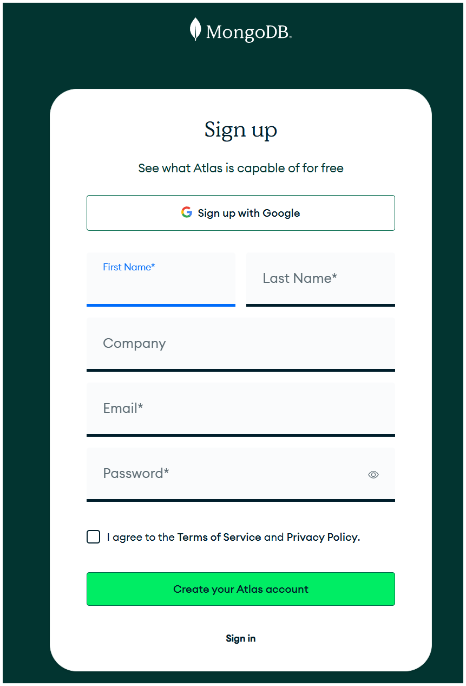
   
   - Create organization (if not present).

   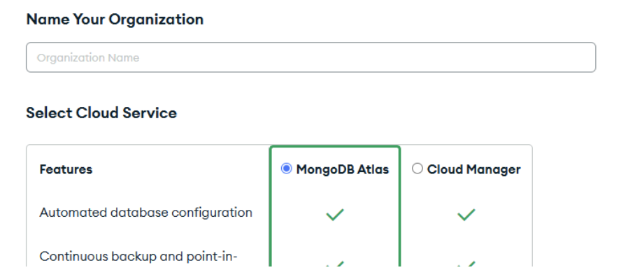

   - Then Create project.

   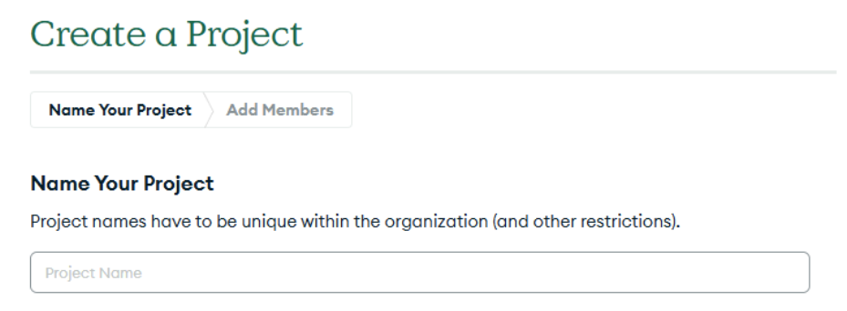

   - Create cluster (Choose FREE Option)

   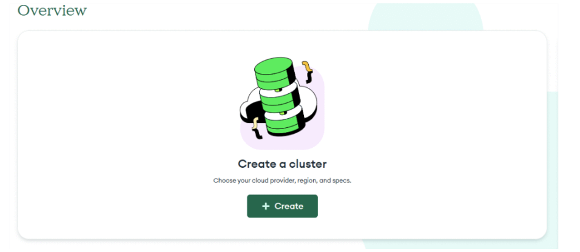
 
   - Deploy cluster:

   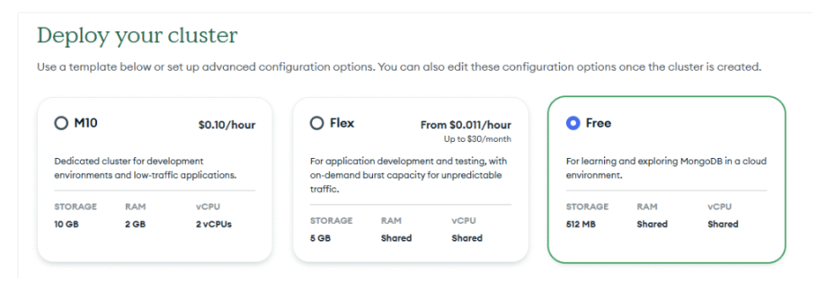
 
   - Then Connect to Cluster -> Create Database User -> Choose a connection method.

   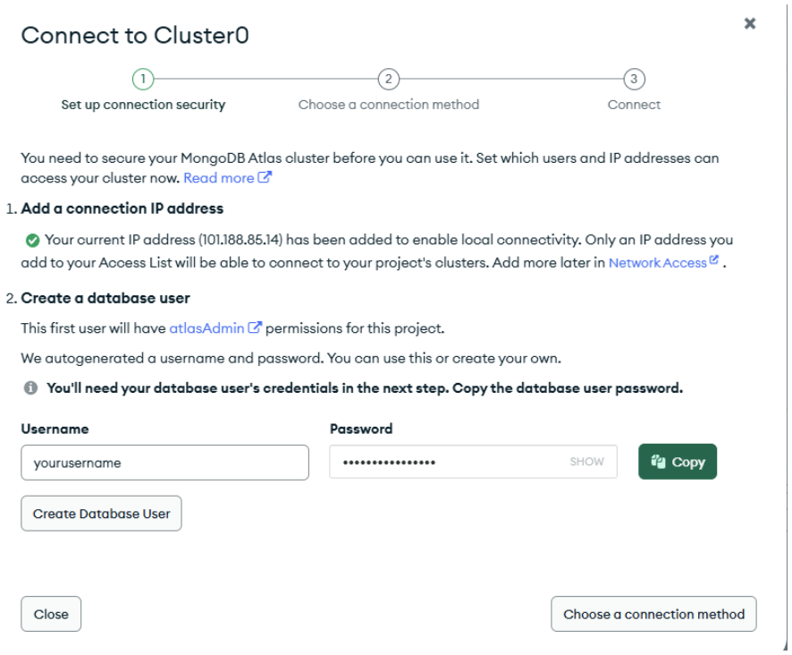

   - Connection Method: Connect to your application -> Drivers.

   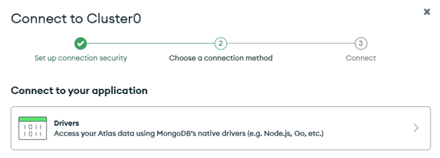
  
   - Select driver, install driver and save your connection string:

   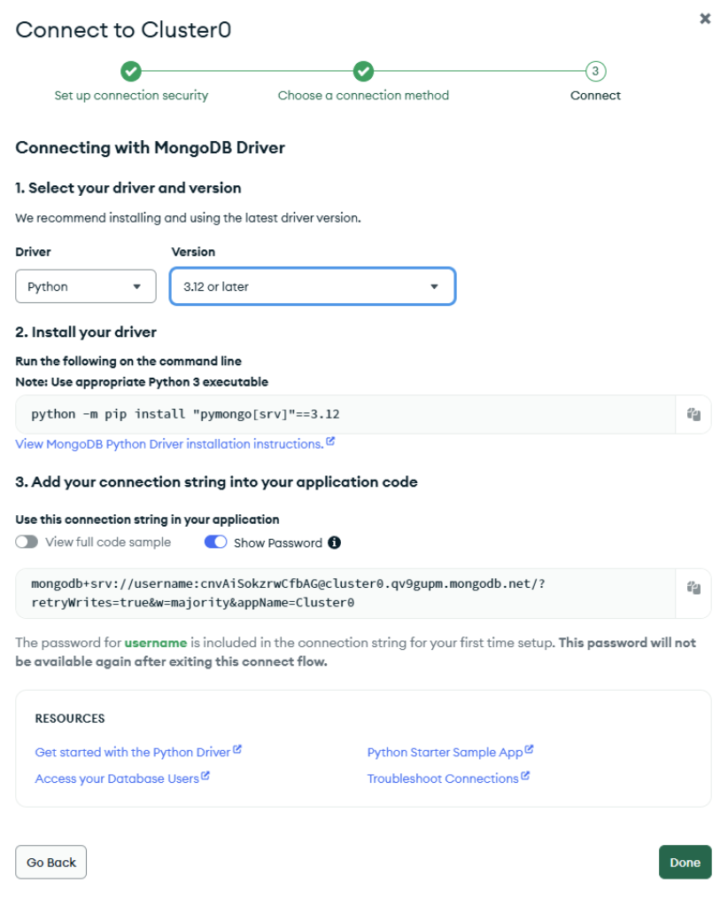
  
   - Use connection string in the code. Just replace the connection string in the code:

   ```app.config["MONGO_URI"] = "mongodb+srv://..."```

## 7. Then, simple run in terminal:
   - python main.py 

   

# Output:
## 1. Once you run ```python main.py``` you should get output in terminal like this:

   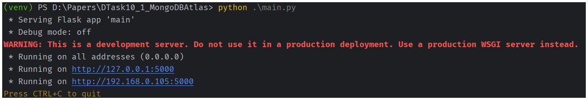
   
and in browser:

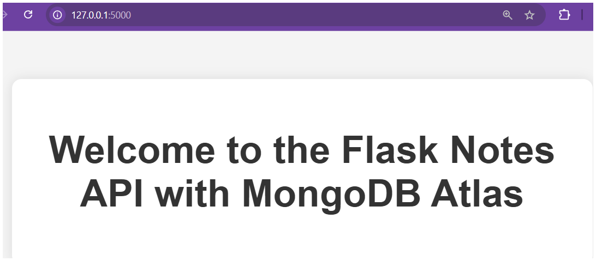

## 2. You can try various routes (urls) as:
   - Just chek the connection first using /ping route as below:
   
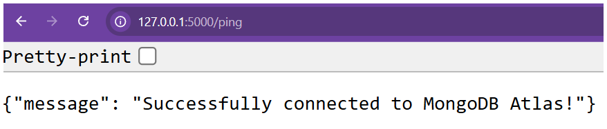    

   - http://127.0.0.1:5000/notes-page 
(Run on your browser and it should output like below)
     (NOTE: You will only see list if you already run android app or created database with input data. 
     you can do that after running sample frontend android app provided.)


  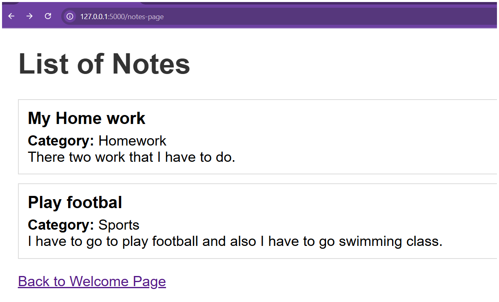 gives
 
  - http://127.0.0.1:5000/notes
  
  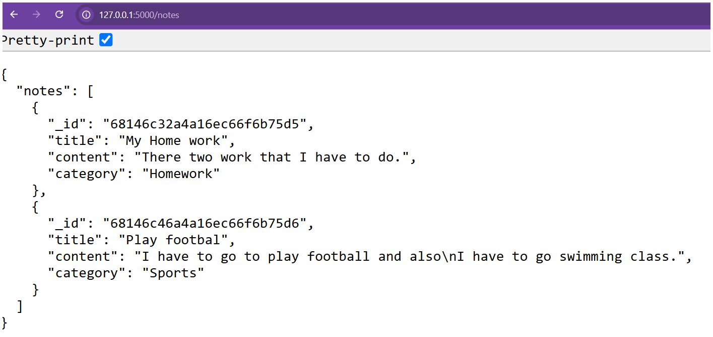

##  3. If you don't see theses, just run the front end android app and add notes from there or use postman.

### In postman, 

 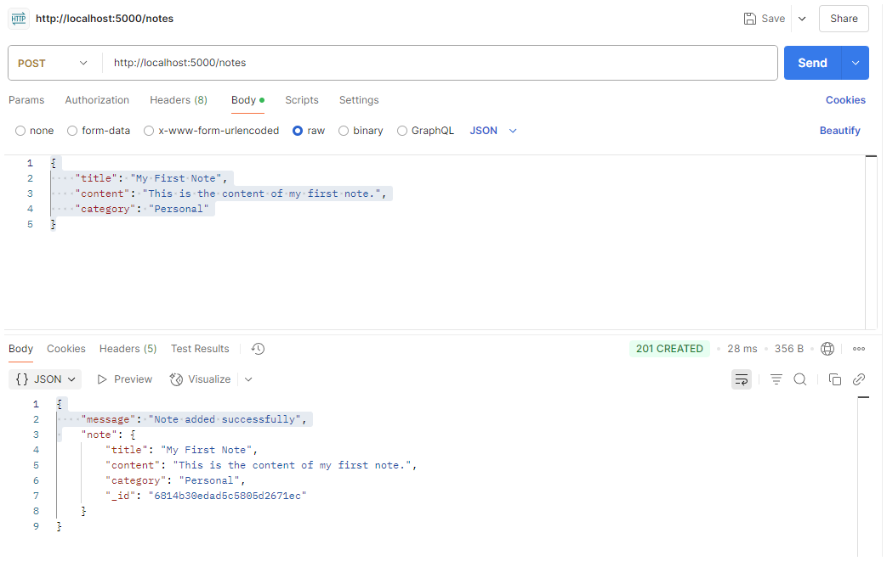

### In Android App,

<div style="display: flex; gap: 10px;">
  
  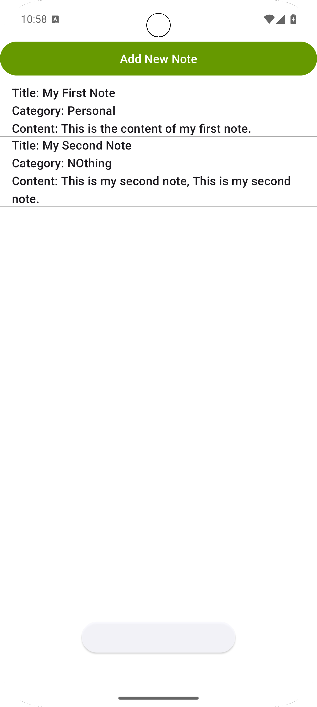
  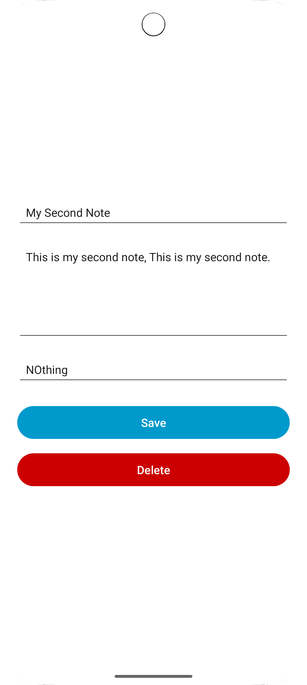
</div>

#References:
https://pypi.org/project/Flask-PyMongo/
https://www.mongodb.com/resources/products/fundamentals/mongodb-tutorials
https://www.w3schools.com/mongodb/
https://www.mongodb.com/resources/products/compatibilities/setting-up-flask-with-mongodb
https://www.mongodb.com/developer/languages/python/flask-python-mongodb/
https://www.mongodb.com/developer/products/mongodb/best-practices-flask-mongodb/
https://www.digitalocean.com/community/tutorials/how-to-use-mongodb-in-a-flask-application